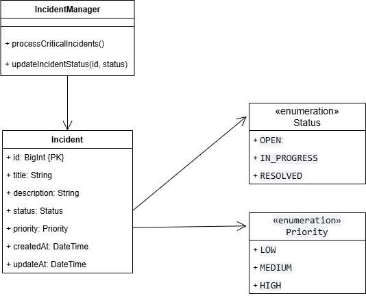

# 🛡️ Kalium Incident Manager (CLI)

Sistema de gestión de incidentes desarrollado con **Laravel Zero** y **Eloquent ORM**, utilizando **SQLite** como motor de base de datos local. Este proyecto permite la administración, visualización y procesamiento de incidentes de seguridad a través de una interfaz de línea de comandos (CLI).

## 🚀 Requisitos del Sistema

* **PHP:** 8.1 o superior.
* **Composer:** Para la gestión de dependencias.
* **Extensiones:** `php-sqlite3`, `php-mbstring`, `php-xml`.

## 🛠️ Instalación y Configuración

1.  **Clonar el repositorio:**
    ```bash
    git clone <url-del-repositorio>
    cd KaliumIncidentManager
    ```

2.  **Instalar dependencias:**
    ```bash
    composer install
    ```

3.  **Configurar la Base de Datos:**
    El sistema utiliza un archivo SQLite local. Asegúrate de que el archivo existe y ejecuta las migraciones para crear la estructura de tablas:
    ```bash
    php kalium migrate:refresh
    ```

---

## 💻 Comandos Disponibles

El punto de entrada principal es el ejecutable `php kalium`.

### 1. Listar Incidentes
Muestra todos los incidentes registrados en una tabla formateada.
```bash
php kalium incidents:list
```

### 2. Crear Nuevo Incidente
Permite el registro manual de un incidente desde la terminal.
```bash
php kalium incidents:create
```
### 3. Procesamiento Masivo (Prioridad Crítica)
Cambia automáticamente a IN_PROGRESS todos los incidentes con prioridad HIGH que estén en estado OPEN.
```bash
php kalium incidents:process
```
### 4. Procesar Incidente Individual (Por ID)
Permite procesar un incidente específico validando su existencia y estado previo.
```bash
php kalium incidents:process-one {id}
```
Ejemplo: php kalium incidents:process-one 1

---

## 🏗️ Arquitectura y Diseño

El proyecto aplica principios fundamentales de **Arquitectura de Software** y **Patrones de Diseño** para asegurar la mantenibilidad y escalabilidad del sistema:

* **Modelo de Dominio (`Incident`):** Actúa como la única fuente de verdad para la estructura de los datos. Implementa la integridad referencial mediante el uso de tipos enumerados (`Status`, `Priority`), garantizando que los incidentes solo transiten por estados válidos.
* **Capa de Servicio (`IncidentManager`):** Encapsula la lógica de negocio compleja (como el procesamiento masivo de incidentes críticos), desacoplándola de la interfaz de usuario (CLI). Esto permite que la lógica sea reutilizable en otros contextos (como una API futura).
* **Persistencia Robusta:** Se implementó una llave primaria (`id`) de tipo **BigInt Autoincremental** para garantizar la unicidad de los registros, junto con un timestamp de creación (`createdAt`) para cumplir con estándares de trazabilidad y auditoría técnica.

## 📊 Diagrama de Clases UML

El diseño estructural se representa en el siguiente diagrama, el cual ilustra la separación de responsabilidades entre la lógica de gestión y la entidad de datos:



---

## 👨‍💻 Autor
**Brayan C / Full-stack Developer**


